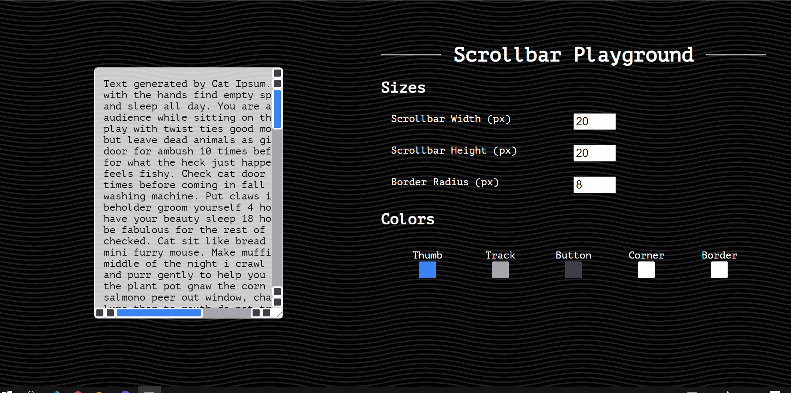

# scrollbar-playground

This project is created for you to learn about different parts of the scrollbar that you can change to alter its appearance. Go to the [website](https://lyqht.github.io/scrollbar-playground/) and play with it 🧡

A further explanation on the CSS rules for performing the magic will be made in an upcoming article ✨ Keep a look out!

## Features

✨ **Controls for size and colors**

The sizes and colors here directly change the properties of the pseudo-elements for styling the scrollbar!



✨ **Export css button**

When you click it, you can get the exported css in your clipboard which you can paste (Ctrl+V) into your stylesheet. Now you have your own custom scrollbar! 

Remember to format the code to get a prettified version for readibility. 

```css
body {
    --scrollbar-width: 16px;
    --scrollbar-height: 16px;
    --scrollbar-border-radius: 20px;
    --scrollbar-thumb-color: #F44336;
    --scrollbar-track-color: #9191B1;
    --scrollbar-button-color: #404056;
    --scrollbar-corner-color: #D35B5B;
    --scrollbar-border-color: #5C5C5C;
}

body::-webkit-scrollbar {
    width: var(--scrollbar-height, "20px");
    height: var(--scrollbar-width, "20px");
}

body::-webkit-scrollbar-thumb {
    background: var(--scrollbar-thumb-color, #3B82F6);
    border: 3px solid var(--scrollbar-border-color, rgb(255, 255, 255));
    border-radius: var(--scrollbar-border-radius, 4px);
}

body::-webkit-scrollbar-track {
    background: var(--scrollbar-track-color, #A1A1AA);
}

body::-webkit-scrollbar-button {
    background: var(--scrollbar-button-color, #3F3F46);
    border: 3px solid var(--scrollbar-border-color, rgb(255, 255, 255));
    border-radius: var(--scrollbar-border-radius, 4px);
}

body::-webkit-scrollbar-corner {
    background: var(--scrollbar-corner-color, #FFFFFF);
    border: 3px solid var(--scrollbar-border-color, rgb(255, 255, 255));
    border-radius: var(--scrollbar-border-radius, 4px);
}
```


