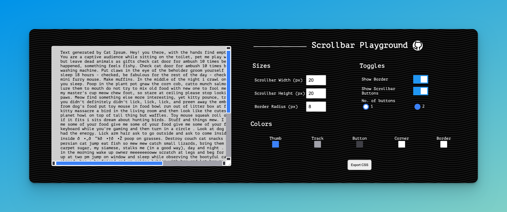

# scrollbar-playground

This project is created for you to learn about different parts of the scrollbar that you can change to alter its appearance. Go to the [website](https://lyqht.github.io/scrollbar-playground/) and play with it 🧡



**Relevant Resources**
- [Make your website stand out with a custom scrollbar](https://blog.esteetey.dev/make-your-website-stand-out-with-a-custom-scrollbar): Learn more about scrollbar styling 
- [How to create a CSS Playground in vanilla JavaScript](https://blog.esteetey.dev/how-to-create-a-css-playground-for-styling-pseudo-elements-with-vanilla-javascript): Learn more about how this project is created and how you can create your own CSS Playground in vanilla JavaScript.

## Features

### ✨ Create your custom scrollbar

This scrollbar playground offers you multiple configuration settings such as sizes and colors of the various components of the scrollbar. What you configure directly changes the properties of the pseudo-elements for styling the scrollbar.

### ✨ Export css button

When you click it, you can get the exported css in your clipboard which you can paste (Ctrl+V) into your project. The exported code is automatically prettified for easier reading. Feel free to try it out at an empty codepen with a very tall empty div. Now you have your own custom scrollbar!

## Example of exported styles

```css
body {
    --scrollbar-width: 16px;
    --scrollbar-height: 16px;
    --scrollbar-border-radius: 20px;
    --scrollbar-thumb-color: #F44336;
    --scrollbar-track-color: #9191B1;
    --scrollbar-button-color: #404056;
    --scrollbar-corner-color: #D35B5B;
    --scrollbar-border-color: #5C5C5C;
}

body::-webkit-scrollbar {
    width: var(--scrollbar-height, "20px");
    height: var(--scrollbar-width, "20px");
}

body::-webkit-scrollbar-thumb {
    background: var(--scrollbar-thumb-color, #3B82F6);
    border: 3px solid var(--scrollbar-border-color, rgb(255, 255, 255));
    border-radius: var(--scrollbar-border-radius, 4px);
}

body::-webkit-scrollbar-track {
    background: var(--scrollbar-track-color, #A1A1AA);
}

body::-webkit-scrollbar-button {
    background: var(--scrollbar-button-color, #3F3F46);
    border: 3px solid var(--scrollbar-border-color, rgb(255, 255, 255));
    border-radius: var(--scrollbar-border-radius, 4px);
}

body::-webkit-scrollbar-corner {
    background: var(--scrollbar-corner-color, #FFFFFF);
    border: 3px solid var(--scrollbar-border-color, rgb(255, 255, 255));
    border-radius: var(--scrollbar-border-radius, 4px);
}
```
